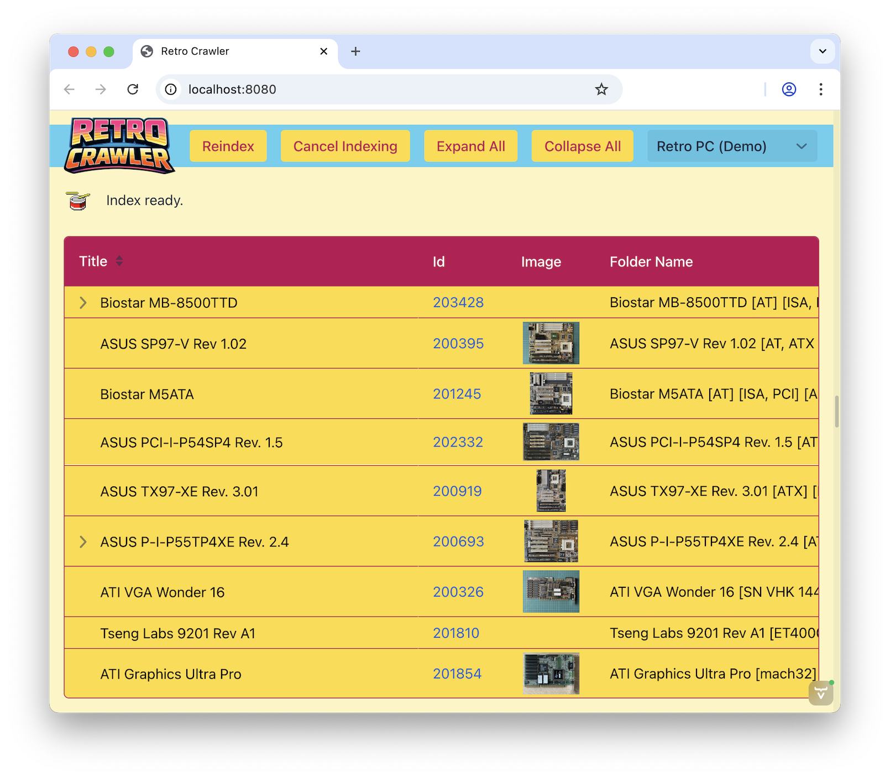

## 

**RetroCrawler** is a Java framework for *structurally crawling* directory-based archives and turning them into typed domain objects so you can manage your stash of retro gear.

If you are like us then you have your collection organized as files and folders. This is simple, pragmatic and backup-friendly. Because of this, RetroCrawler is designed specifically for collections that were **not originally structured as databases** — such as retro computer hardware documentation (pictures, manuals, drivers), software archives, ROM libraries or document repositories.

RetroCrawler does not require specific schemas, metadata files, or folder layouts.
Instead, you can use your own personal already existing folder structure, provide context via `ClueFinder`s, `FactParser`s and `GearMatcher`s and ReroCrawler **infers structure from context** using a two-phase pipeline.

---

## Core Concepts

### Archive
A directory tree on disk that serves as the data source.

### Artifact
An optional representation of a single folder in the archive.
An artifact exists only if meaningful information can be extracted from that folder which we call `Clue`s. This is a raw representation of a single **potential** piece of your collection.

### Clue
A raw key–value observation derived from:
- folder names
- file names
- file contents

Clues are always **string-based** and may contain multiple values. This is a raw representation of a **potential** property of a piece in your collection.

### Gear
A user-defined domain object created from a set of facts. This is an **identified**, real piece in your collection.
Gear types are **not** required to implement framework interfaces and require only a no-arg constructor. It's "bring your own type".

### Fact
A typed interpretation of a clue.
Facts are produced by user-defined parsers and may be any Java type.

---

## Processing Pipeline

RetroCrawler operates in two distinct phases:

### 1. Archive / Clue Phase
The archive is traversed recursively.
For each folder, registered `ClueFinder`s extract clues and produce an `Artifact`.

The extracted clue archive is stowed away through an application-selected `Repository` so that expensive rescans can be avoided. The bundled `JsonFileRepository` uses JSON files on local storage. Once a scan is done, queries on the archive are blazingly fast. If you restart your app, the archive is quickly retrieved from the repository.

Most clue finders inspect only the current folder name or its direct files.
Collections with meaningful metadata subtrees may additionally configure
`TreeClueFinder`s. These run depth-first in post-order through a transient
`ArchiveFolderView`, may inspect file content lazily through
`ArchiveFileView.peek(...)`, and return clues for the current folder. Child
folders that already established an artifact are pruned from the view, so a
finder cannot cross into another potential collection part.

### 2. Gear / Fact Phase
All known clues are converted into facts using registered parsers.
Based on these facts, `GearMatcher`s determine which gear type best represents an artifact.
The corresponding `GearFactory` then creates the final domain object.

Unknown or unparseable clues are preserved and may be accessed explicitly.

---

## Configuration via Annotations

RetroCrawler's collection and gear model can be configured via annotations:

- `@RetroCollection`
  Declares the collection identity, source locations, optional working
  directory, and `ArchivePathFilter`. Exactly one collection is present in a
  model.

- `@RetroClues`
  Declares which folder names, file names, file contents, and folder trees
  produce crawl-time clues.

- `@RetroGear`
  Declares a gear type and its matcher.

- `@RetroFact`
  Declares how a field is populated from a clue.

- `@RetroFactParser`
  Optionally overrides collection-specific configuration for a fact parser.
  It does not select or instantiate that parser.

- `@RetroAnyAttribute`
  Captures all remaining unassigned facts. Especially useful on "catch all" default gear types that are produced if none others match.

This allows the framework to remain strongly typed while requiring minimal boilerplate.

Filesystem noise can be pruned before entries are classified or supplied to
clue finders. The bundled opt-in filter ignores every dot-prefixed entry and
common operating-system or NAS service entries such as `Thumbs.db`,
`__MACOSX`, `@Recycle`, and `System Volume Information`:

```java
@RetroCollection(
        id = "my_collection",
        locations = "my-collection",
        pathFilters = {
                IgnoreDotPaths.class,
                IgnoreWindowsSystemPaths.class,
                IgnoreMacSystemPaths.class,
                IgnoreLinuxSystemPaths.class,
                IgnoreQNAPSystemPaths.class,
                IgnoreSynologySystemPaths.class
        })
```

An entry must be accepted by every configured filter; an empty list accepts
everything. Applications can implement `ArchivePathFilter` with a public
no-argument constructor for annotation use, or inject configured instances
through `Model.Builder.pathFilters(...)`. Rejecting a folder prunes its
entire subtree during both crawl planning and digging. Changing the filters
requires a re-index because retrieved clue archives retain the result of their
original crawl.

---

## Model Discovery

RetroCrawler discovers annotated archive and gear types recursively below an application's base package:

```java
Model model = Model.from("com.example.collection");
```

Applications that need deterministic or custom discovery can instead provide a `Set<Class<?>>` or `TypeSource`.

Deployment-specific settings can override annotation defaults while the model
is built:

```java
Model model = Model.builder()
        .typesFrom("com.example.collection")
        .locations(Path.of("my-collection"))
        .workingDirectory(Path.of("retro-work"))
        .factParser(MyCatalogParser.class,
                configuration -> configuration.catalogFile("my-catalog.tsv"))
        .build();
```

External parser catalogs resolve below the working directory's `catalogs`
folder. Configuring a parser does not manifest it: a catalog is loaded only
when a discovered field-level `@RetroFact` actually selects that parser.

Catalogs use one strict UTF-8 TSV format. Any number of blank or `#` comment
lines are allowed. The first data line contains enum constant names as headers;
all keys must occur exactly once, while their order is arbitrary.

---

## Optional Shared Model

RetroCrawler remains a bring-your-own-type framework. The optional
`retro-crawler-model` module provides reusable value types and canonical
parsers for facts whose meaning is stable across collections, including ISBNs,
MAC addresses, category-qualified The Retro Web references, expansion buses,
memory vocabulary, and data capacities.

Collection adapters remain responsible for mapping their own folder tags,
metadata files, or other clues onto that shared vocabulary. The core does not
depend on the shared model.

---

## Archive Repository

Applications must explicitly select a `Repository`. `JsonFileRepository` is a
convenient persistent implementation and uses the local `cache` directory when
constructed without a path:

```java
Model model = Model.from("com.example.collection");
Repository repository = new JsonFileRepository(Path.of("my-cache"));

RetroCrawler crawler = RetroCrawler.builder()
        .model(model)
        .repository(repository)
        .build();
```

For applications that only need the extracted archives for the lifetime of the
process, the framework also supplies a thread-safe `InMemoryRepository`:

```java
Repository repository = new InMemoryRepository();
```

An in-memory repository does not write to the filesystem and starts empty after
an application restart.

A missing stored archive causes the filesystem archive to be crawled. If a stored archive cannot be retrieved, RetroCrawler reports the repository failure and rebuilds it from the filesystem source.

---

## Progress and Cancellation

Crawler operations accept a `Progressor`. It publishes immutable, structured
snapshots with an extensible stage, human-readable message, exact or
approximate work units, timing, and operation state. A lightweight message
view is available for simple command-line or GUI integrations:

```java
Progressor progressor = Progressor.reportingMessages(System.out::println);
List<MyGear> gear = crawler.crawlGear(progressor, true, MyGear.class);
```

Calling `progressor.cancel("Stopping.")` is thread-visible and aborts the crawl
at its next checkpoint. For larger workflows, progressors can be divided into
nested equal or weighted windows with `splitIntoEqualParts(...)` and
`splitInRelationTo(...)`.

---

## Design Goals

- No database
- No imposed interfaces on user domain models
- Strong typing without forcing predefined structures
- Incremental and cacheable processing
- Minimal core dependencies
- Suitable for both CLI tools and GUI applications (e.g. Vaadin)

---

## Prerequisites

- Electricity
- Java 21+
- Apache Maven
- Node v25 (Vaadin demo app only)

---

## Demo App

Since RetroCrawler is a library, we provide a demo app based on the Vaadin UI framework so you can see how all comes together. You can use this as a starting point for building your own gui. But please note that compared to `retro-crawler-core` keeping `retro-crawler-app` stable is not a priority. Anything might change any time.

You can run the demo app via a provided shell script (macOS) or batch file (Windows). CD into `/run` located in the root of the repository. Then run the script. This should build and install RetroCrawler and launch the Vaadin app. Once it runs you can access it via `localhost:8080`. The demo scenario is called "Retro PC" and the archive (data folder) it is based on is located at `/retro-crawler-app/archives/retro_pc`. RetroCrawler will create a folder `retro-crawler-app/cache` where the JSON cache file is located. This folder is on the Git ignore list.

#### macOS
```sh
cd run
./app.sh
```

#### Windows
```batch
cd run
app.bat
```

## Command Line Demo

Even though the demo app is nice: If you do not want to install the black hole that is `node.js` and then watch maven download half the internet just to see how RetroCrawler works we have also created a command line demo. Just like the Demo App above you can run it via `cli.sh` or `cli.bat` respectively.

Just don't expect anything spectacular.

---

## Status

RetroCrawler is currently under active development.
APIs may evolve, but we try to keep core concepts stable.

Again: The apps (Vaadin / command line) are just there for demo purposes and so you have something to copy to get going.

## Legal

Developed following Starfleet Corps of Engineers (SCE) standard procedure. May only be used inside the juristiction of the United Federation of Planets.
