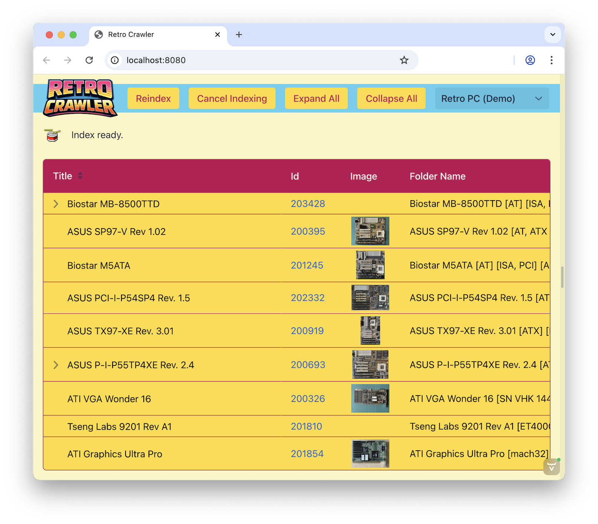

# RetroCrawler


**RetroCrawler** is a Java framework for structurally crawling directory-based
archives and turning the clues in their files and folders into typed domain
objects—your collection's Gear.

Keep the personal folder structure that already works for you. RetroCrawler
does not require a database, a prescribed schema, or a particular metadata
format; collection adapters describe how existing evidence becomes a model.



*The Vaadin demo browses a resolved Stash, its Gear hierarchy, and the Facts
inferred from the underlying archive.*

## Why RetroCrawler?

- **The filesystem remains the archive.** Your pictures, manuals, drivers,
  ROMs, documents, and metadata stay in ordinary backup-friendly folders.
- **Bring your own model.** Gear types are plain Java classes; annotations and
  small extension points connect them to the archive.
- **Interpret instead of reorganize.** Model changes can reinterpret a cached
  clue archive without physically crawling the source again.
- **Keep the evidence.** Facts retain their source clues, resources have stable
  Archive Resource Identifiers (ARIs), and every resolved Gear node can carry
  a trace explaining its selection.
- **Use the same Stash everywhere.** Typed queries serve GUI applications, CLI
  tools, MCP adapters, and other integrations through one deterministic API.

RetroCrawler is aimed particularly at collections of retro computer hardware,
but its archive, clue, Fact, and Gear model is not hardware-specific.

## How it works

```text
archive folders → Clues → Facts → matched Gear → queryable Stash
```

The two sides of the pipeline are deliberately separate:

1. During crawling, `ClueFinder`s observe model-independent string clues in
   folder names, file names, and optionally file contents. The resulting clue
   archive can be cached.
2. During resolution, `FactParser`s interpret those clues as typed Facts.
   `GearMatcher`s select the most appropriate Gear type, and a `GearFactory`
   creates the final domain object.

Unknown clues survive resolution. The original archive remains the source of
truth, while the Stash is a fast, rebuildable view of it. Read more about the
[concepts and processing model](docs/concepts.md).

## Try the demo

The Vaadin demo is the quickest way to see the pieces together. It requires
Java 21, Apache Maven, and Node 25. From the repository root:

```sh
cd run
./app.sh
```

On Windows:

```batch
cd run
app.bat
```

Once it starts, open `http://localhost:8080`. The demo can crawl the same
sample collection from an ordinary directory or directly from a ZIP archive.

If installing the black hole that is Node.js just to look at a Java library
seems excessive, use the command-line demo instead:

```sh
cd run
./cli.sh
```

Windows provides the corresponding `cli.bat` launcher. Do not expect anything
spectacular; it is a command line, after all.

## Minimal example

A model declares how a collection is interpreted. Archive locations and
repositories are runtime configuration:

```java
Model model = Model.from("com.example.collection");

RetroCrawler crawler = RetroCrawler.builder()
        .model(model)
        .repository(new JsonFileRepository(Path.of("my-cache")))
        .archive(ArchiveDescriptor.of(
                ArchiveId.of("my_archive"), Path.of("my-archive")))
        .build();

Batch<MyGear> gear = crawler.access(new Journal())
        .query(MyGear.class)
        .pull();
```

Models are normally discovered recursively from `@RetroCollection`,
`@RetroClues`, `@RetroGear`, and `@RetroFact` declarations. Deterministic type
sets and custom type sources are available when package discovery is not the
right boundary. See [modeling and querying](docs/modeling.md).

## Core vocabulary

| Term | Meaning |
|---|---|
| **Archive** | One identified hierarchical collection holding, exposed by a filesystem, ZIP, or another provider. |
| **Artifact** | The raw representation of one archive folder from which meaningful clues were extracted. Random folders without descernable clues do not become artifacts.|
| **Clue** | A model-independent string observation made while crawling. |
| **Fact** | A typed, model-dependent interpretation that retains its source clue. |
| **Gear** | A user-defined domain object representing an identified piece of the collection. |
| **Stash** | The complete immutable hierarchy of resolved Gear across the crawler's archives. |

Within one Artifact, every explicit clue key has exactly one authority. Any
number of anonymous observations may coexist, but RetroCrawler never silently
merges separate finders' claims. The detailed contract and diagnostics are in
[Concepts and processing](docs/concepts.md).

## Modules

| Name | Description |
|---|---|
| `retro-crawler-core` | reusable framework API and implementation. |
| `retro-crawler-model` | optional shared Facts and canonical parsers. |
| `retro-crawler-mcp` | reusable MCP adapter and Spring Boot auto-configuration. |
| `retro-crawler-server` | generic executable MCP host. |
| `retro-crawler-demo` | sample archive model, clue finders, and data. |
| `retro-crawler-mycollection` | one collection-specific adapter. |
| `retro-crawler-app` | Vaadin demonstration application. |
| `retro-crawler-cli` | command-line demonstration application. |

The applications are examples rather than stable public APIs. The core remains
independent of the optional shared model, demos, UI, and protocol adapters.

## Documentation

| Document | Covers |
|---|---|
| [Concepts and processing](docs/concepts.md) | clues, Facts, Gear, provenance, diagnostics, and the two-phase pipeline. |
| [Modeling and querying](docs/modeling.md) | annotations, discovery, matching, typed queries, resolution traces, and filters. |
| [Archives and resources](docs/archives.md) | providers, ZIP archives, ARIs, inspection, reindexing, and crawl observations. |
| [Repositories and operations](docs/operations.md) | cached clue archives, progress, cancellation, and fail-late validation. |
| [Development and demos](docs/development.md) | prerequisites, builds, formatting, and demo behavior. |

## Build and test

Run the normal test suite from the repository root:

```sh
mvn test
```

Use `mvn clean install` to verify packaged module boundaries. Project-specific
formatting and development setup are described in
[Development and demos](docs/development.md).

## Status

RetroCrawler is under active development. Core concepts are intended to remain
stable, but APIs may evolve. The Vaadin and command-line applications are
demonstrations and may change at any time.

## Legal

Developed following Starfleet Corps of Engineers (SCE) standard procedure. May
only be used inside the jurisdiction of the United Federation of Planets.
